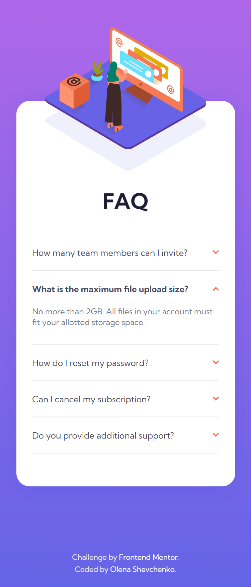
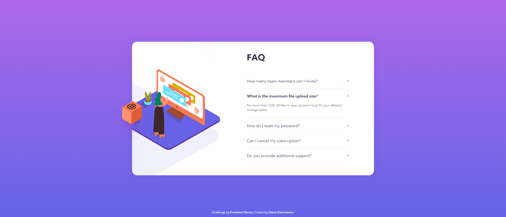

# Frontend Mentor - FAQ accordion card solution

This is a solution to the [FAQ accordion card challenge on Frontend Mentor](https://www.frontendmentor.io/challenges/faq-accordion-card-XlyjD0Oam). Frontend Mentor challenges help you improve your coding skills by building realistic projects. 

## Table of contents

  - [The challenge](#the-challenge)
  - [Screenshot](#screenshot)
  - [Links](#links)
  - [Built with](#built-with)
  - [What I learned](#what-i-learned)
- [Author](#author)

### The challenge

Users should be able to:

- View the optimal layout for the component depending on their device's screen size
- See hover states for all interactive elements on the page
- Hide/Show the answer to a question when the question is clicked

### Screenshot

### Links

- Solution URL: (https://github.com/olenahelena/accordion_card_solution)
- Live Site URL: (https://eloquent-monstera-9a382b.netlify.app/)

### Built with

- Semantic HTML5 markup
- SCSS 
- Flexbox
- Mobile-first workflow
- JavaScript

### What I learned

I have learned more about JavaScript functions, also I learned more about FAQ accordion. It was tricky to build function that will close previous items and open new item. 

## Author

- Website - (https://github.com/olenahelena)
- Frontend Mentor - [@olenahelena](https://www.frontendmentor.io/profile/olenahelena)
